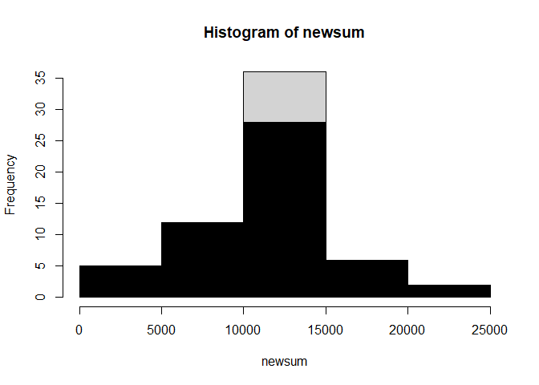

## Loading and preprocessing the data

```r
x<-read.csv("activity.csv")
###load activity.csv file
 x$date<-as.Date(x$date,"%Y-%m-%d")
```


## What is mean total number of steps taken per day?

### 1.Calculate the total number of steps taken per day

```r
tapply(x$steps, x$date, sum)->y
y
```

```
## 2012-10-01 2012-10-02 2012-10-03 2012-10-04 2012-10-05 2012-10-06 2012-10-07 
##         NA        126      11352      12116      13294      15420      11015 
## 2012-10-08 2012-10-09 2012-10-10 2012-10-11 2012-10-12 2012-10-13 2012-10-14 
##         NA      12811       9900      10304      17382      12426      15098 
## 2012-10-15 2012-10-16 2012-10-17 2012-10-18 2012-10-19 2012-10-20 2012-10-21 
##      10139      15084      13452      10056      11829      10395       8821 
## 2012-10-22 2012-10-23 2012-10-24 2012-10-25 2012-10-26 2012-10-27 2012-10-28 
##      13460       8918       8355       2492       6778      10119      11458 
## 2012-10-29 2012-10-30 2012-10-31 2012-11-01 2012-11-02 2012-11-03 2012-11-04 
##       5018       9819      15414         NA      10600      10571         NA 
## 2012-11-05 2012-11-06 2012-11-07 2012-11-08 2012-11-09 2012-11-10 2012-11-11 
##      10439       8334      12883       3219         NA         NA      12608 
## 2012-11-12 2012-11-13 2012-11-14 2012-11-15 2012-11-16 2012-11-17 2012-11-18 
##      10765       7336         NA         41       5441      14339      15110 
## 2012-11-19 2012-11-20 2012-11-21 2012-11-22 2012-11-23 2012-11-24 2012-11-25 
##       8841       4472      12787      20427      21194      14478      11834 
## 2012-11-26 2012-11-27 2012-11-28 2012-11-29 2012-11-30 
##      11162      13646      10183       7047         NA
```
### 2.Make a histogram of the total number of steps taken each day

```r
hist(y, breaks = 20)
```

<!-- -->
### 3.Calculate and report the mean and median of the total number of steps taken per day

```r
median(y,na.rm=TRUE)
```

```
## [1] 10765
```

```r
mean(y,na.rm=TRUE)
```

```
## [1] 10766.19
```


## What is the average daily activity pattern?


```r
na.omit(x)->x1
tapply(x1$steps,x1$interval,mean)->z
plot(unique(x1$interval),z,type="l")
```

<!-- -->

### Which 5-minute interval, on average across all the days in the dataset, contains the maximum number of steps?

```r
as.data.frame.table(z)->zdt
as.integer(as.character(zdt$Var1))->zdt$Var1
max(zdt$Freq)->max
zdt[zdt$Freq==max,1]
```

```
## [1] 835
```


## Imputing missing values
### 1.Calculate and report the total number of missing values in the dataset


```r
na_count <-sapply(x, function(y) sum(length(which(is.na(y)))))
na_count
```

```
##    steps     date interval 
##     2304        0        0
```

### 2. Devise a strategy for filling in all of the missing values in the dataset. 

```r
colnames(zdt)<-c("interval","steps")
na<-x[is.na(x$steps),]
newnadata<-merge(na, zdt, by=c("interval"))
newnadata<-newnadata[,-2]
colnames(newnadata)[3]<-"steps"
```
### 3.Create a new dataset that is equal to the original dataset but with the missing data filled in.

```r
rbind(x1,newnadata)->newdata
```
### 4.hist of mean and median of new and old na data

```r
tapply(newdata$steps,newdata$date, sum)->newsum
mean(newsum)
```

```
## [1] 10766.19
```

```r
median(newsum)
```

```
## [1] 10766.19
```

```r
hist(newsum)
hist(y,col = "black",add=T)
```

<!-- -->

## Are there differences in activity patterns between weekdays and weekends?


```r
newdata$DayCategory <- ifelse(weekdays(newdata$date) %in% c("Saturday", "Sunday"), "Weekend", "Weekday")
```


```r
library(plyr)
```

```
## Warning: package 'plyr' was built under R version 4.0.2
```

```r
library(lattice)
final<- ddply(newdata, .(interval, DayCategory), summarize, Avg = mean(steps))
head(final)
```

```
##   interval DayCategory        Avg
## 1        0     Weekday 2.25115304
## 2        0     Weekend 0.21462264
## 3        5     Weekday 0.44528302
## 4        5     Weekend 0.04245283
## 5       10     Weekday 0.17316562
## 6       10     Weekend 0.01650943
```

```r
##Plot data in a panel plot
xyplot(Avg~interval|DayCategory, final, type="l",  layout = c(1,2),
       main="Average Steps per Interval Based on Type of Day", 
       ylab="Average Number of Steps", xlab="Interval")
```

<!-- -->


